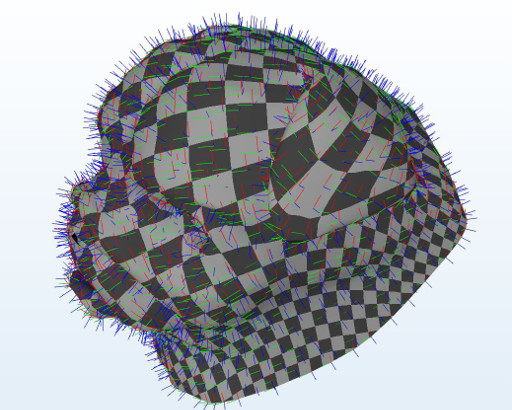
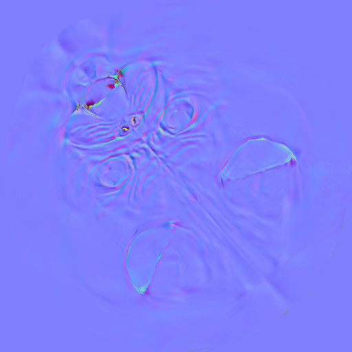
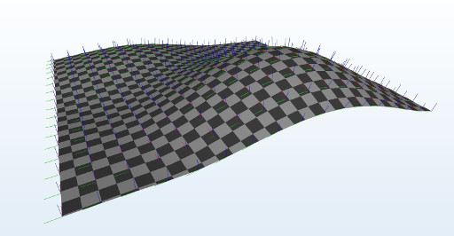

# tgen
Simple Tangent Generator

This is a very basic tangent generator, written in C++.
The main purpose of this project is to facilitate adoption of, and discussion about, the proper setup of tangent spaces for glTF 2.0 assets.

The code consists basically of one header + .cpp file.
For debugging and visualization, there is also a simple X3D exporter in a separate file, which was used to generate the results shown below.
So far, the code has just been compiled and tested with VS 2015.

Feedback and contributions are always welcome. 

## Results

[Web Demo](https://mlimper.github.io/tgen/demo/victor/index.html)

[Web Demo](https://mlimper.github.io/tgen/demo/landscape/index.html)

